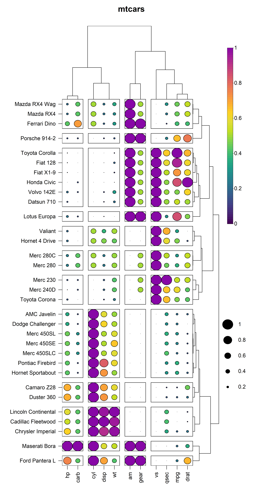

<!-- README.md is generated from README.Rmd. Please edit that file -->

```{r, include = FALSE}
knitr::opts_chunk$set(
  collapse = TRUE,
  comment = "#>",
  fig.path = "man/figures/README-",
  out.width = "100%"
)
```

# HeatmapR 

<!-- badges: start -->
[](https://www.repostatus.org/#active)
[](https://travis-ci.com/DillonHammill/HeatmapR)
[](https://codecov.io/gh/DillonHammill/HeatmapR?branch=master)
[](https://www.tidyverse.org/lifecycle/#maturing)
[)`-yellowgreen.svg)](/commits/master)
<!-- badges: end -->

**HeatmapR** it a lightweight R package that makes it easy to generate high quality, complex heatmaps with minimal data preprocessing or manual customization. Visit the **HeatmapR** website to get started https://dillonhammill.github.io/HeatmapR/.

## Overview
As the dimensionality of datasets continues to increase there is a need for visualisation tools such as heatmaps to present data in an easily interpretable way. The construction of complex heatmaps poses a number of challenges as they are composed multiple graphical elements, such as a coloured matrix, dendrograms, cluster sub-divisions, axes, titles and legends. The first base graphics implementation of heatmaps included `heatmap()` in the `stats` package and `heatmap.2()` in the  [gplots](https://cran.r-project.org/web/packages/gplots/index.html). The packages attempt to solve these graphical challenges by treating each graphical component as a separate plot element and arranging them using `layout()`. This approach can generate complex heatmaps but it rendered users unable to arrange the heatmap with additional plot elements. **HeatmapR** aims to address these layout issues using solely a base graphics approach. 

## HeatmapR
**HeatmapR** has a number of benefits over other heatmap packages:

* **HeatmapR** is built using base graphics to remove the need for familiarity with `ggplot2` or `plotly`.
* **HeatmapR** is extremely lighweight and therefore there are no external dependencies that need to be installed.
* **HeatmapR** is designed under ROpenSci naming guidelines for a consistent and intuitive user experience.
* Unlike other heatmap packages that use base graphics, **HeatmapR** actually returns the plot object instead of an image. This makes it easy to arrange multiple plots in complex layouts without sacrificing resolution.
* **HeatmapR** is fully customizable and comes with useful saving API (`heat_map_save()`) to export high resolution images.
* **HeatmapR** handles datasets that contain non-numeric or missing data, which means you don't have to spend ages formatting and pre-processing the data beforehand.
* **HeatmapR** generates publication ready images with minimal manual customization, making it ideal for users that have limited coding experience.

## Installation

**HeatmapR** can be installed directly from GitHub:

```{r, eval = FALSE, echo = TRUE}
devtools::install_github("DillonHammill/HeatmapR")
```

## Usage

Creating heatmaps is as easy as loading **HeatmapR** and supplying your dataset to the `heat_map()` function. For details on customising your heatmaps, refer to the package vignette.

```{r, eval =TRUE, echo = FALSE}
library(HeatmapR)
```

```{r, eval = FALSE}
library(HeatmapR)
heat_map(
  mtcars,
  scale = "column",
  scale_method = "range",
  tree_x = TRUE,
  tree_y = TRUE,
  tree_cut_x = 4,
  tree_cut_y = 12,
  cell_size = TRUE,
  cell_shape = "circle",
  title = "mtcars"
)
```

```{r, eval = FALSE, echo = FALSE}
heat_map_save(
  "man/figures/README-HeatmapR-1.png",
  height = 14,
  width = 8,
  res = 500)
heat_map(
  mtcars,
  scale = "column",
  scale_method = "range",
  tree_x = TRUE,
  tree_size_x = 0.4,
  tree_y = TRUE,
  tree_cut_x = 4,
  tree_cut_y = 12,
  cell_size = TRUE,
  cell_shape = "circle",
  legend_size = 1.2,
  title = "mtcars"
)
```

```{r echo = FALSE, out.width = '95%', fig.align="center"}

```

## Acknowledgements
**HeatmapR** relies on statistical methods in the `stats` package to compute distance matrices and perform hierarchical clustering. **HeatmapR** also uses some modified `stats` code from the  [ggdendro](https://github.com/andrie/ggdendro) package to get the co-ordinates for the dendrogram line segments. 

## Code of Conduct

Please note that the HeatmapR project is released with a [Contributor Code of Conduct](https://contributor-covenant.org/version/2/0/CODE_OF_CONDUCT.html). By contributing to this project, you agree to abide by its terms.

## Citation

If you use **HeatmapR** for your work please cite the package as follows:

```{r, eval = TRUE}
citation("HeatmapR")
```
