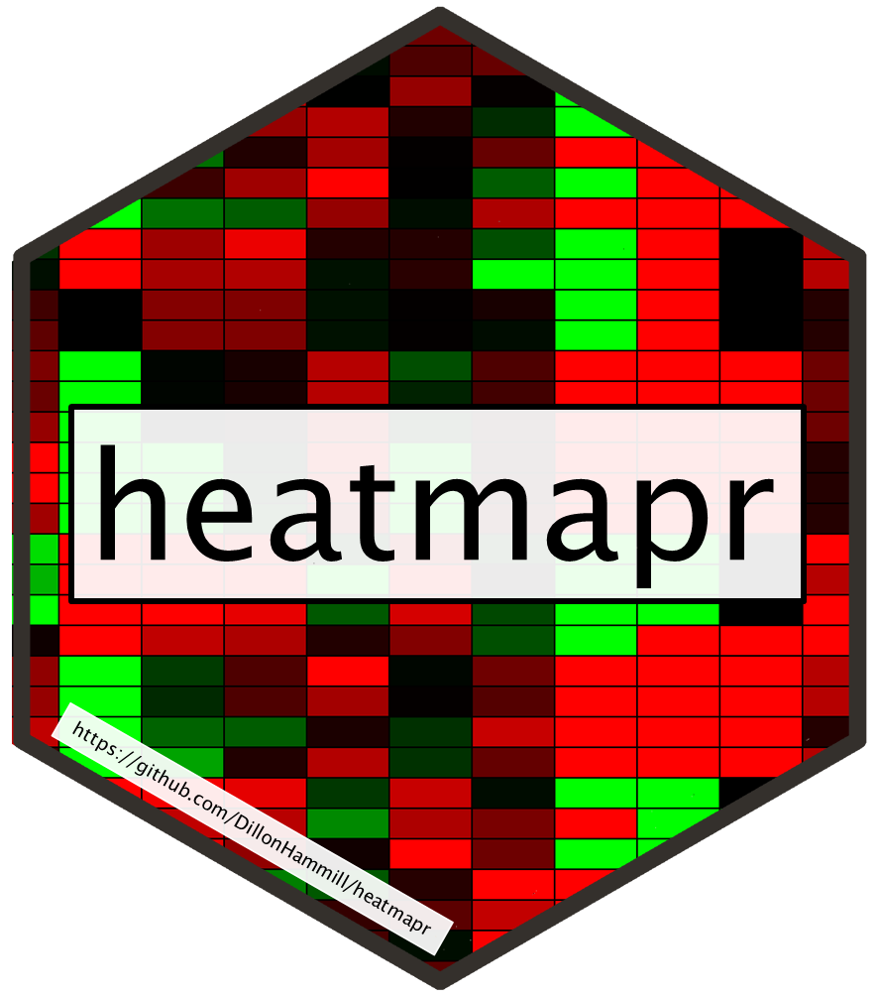

<!-- README.md is generated from README.Rmd. Please edit that file -->

# heatmapr 

<!-- badges: start -->

[](https://www.repostatus.org/#active)
[](https://travis-ci.com/DillonHammill/heatmapr)
[](https://codecov.io/gh/DillonHammill/heatmapr?branch=master)
[](https://www.tidyverse.org/lifecycle/#maturing)
[](/commits/master)
<!-- badges: end -->

The goal of heatmapr is to …

## Installation

You can install the released version of heatmapr from
[CRAN](https://CRAN.R-project.org) with:

``` r
install.packages("heatmapr")
```

And the development version from [GitHub](https://github.com/) with:

``` r
# install.packages("devtools")
devtools::install_github("DillonHammill/heatmapr")
```
