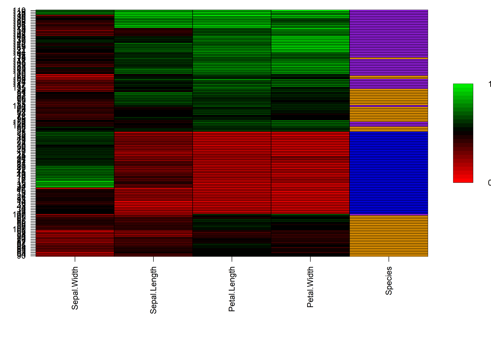

<!-- README.md is generated from README.Rmd. Please edit that file -->

# heatmapr 

<!-- badges: start -->

[](https://www.repostatus.org/#active)
[](https://travis-ci.com/DillonHammill/heatmapr)
[](https://codecov.io/gh/DillonHammill/heatmapr?branch=master)
[](https://www.tidyverse.org/lifecycle/#maturing)
[](/commits/master)
<!-- badges: end -->

**heatmapr** makes it easy to generate high quality heatmaps with
minimal data preprocessing or manual customization.

## Installation

**heatmapr** can be installed directly from GitHub:

``` r
devtools::install_github("DillonHammill/heatmapr")
```

## Usage

Creating heatmaps is as easy as loading **heatmapr** and supplying your
dataset to the `heat_map()` function. This will generate a heatmap with
the default red to green colour scale.

``` r
library(heatmapr)
heat_map(mtcars)
```


Obviously this heatmap is not very informative as the variables in the
`mtcars` dataset are on vastly different scales. Fortunately,
`heat_map()` can take of care of the scaling for us to put all of the
variables on a similar scale. `heat_map()` will perform column-wise
scaling using either the `range`, `mean` or `zscore` scaling methods.
Let’s apply `range` scaling to the `mtcars` dataset and change the
colour scale to white-yellow-red:

``` r
heat_map(mtcars,
         scale = "range",
         box_col_scale = c("white",
                           "yellow",
                           "orange",
                           "red",
                           "darkred"))
```


Clearly, scaling has a big impact on how the data is visualized and so
it is a good idea to play around with the different scaling methods to
get the best visualization of the data. `heat_map()` can also perform
hierachical clustering by `row`, `column` or `both`, and the data can
then be reordered to group the data based on relatedness. This
reordering can be manually turned off by setting `reorder = FALSE`.
Let’s perform hierarchical clustering on both the rows and columns and
allow `heat_map()` to reorder the data:

``` r
heat_map(mtcars,
         scale = "range",
         cluster = "both",
         box_col_scale = c("white",
                           "yellow",
                           "orange",
                           "red",
                           "darkred"))
```


Sometimes it is useful to include non-numeric variables in the heatmap
as well. `heat_map()` takes care of this by moving non-numeric variables
to the right of the heatmap and does not use these variables during
scaling and clustering. Colours for these non-numeric variables are
selected from `box_col_palette`. Here is an example using the `iris`
dataset, in which the `species` column contains non-numeric data.

``` r
heat_map(iris,
         scale = "range",
         cluster = "both",
         box_col_scale = c("red", 
                           "black",
                           "green"),
         box_col_palette = c("purple",
                             "orange",
                             "blue"))
```


