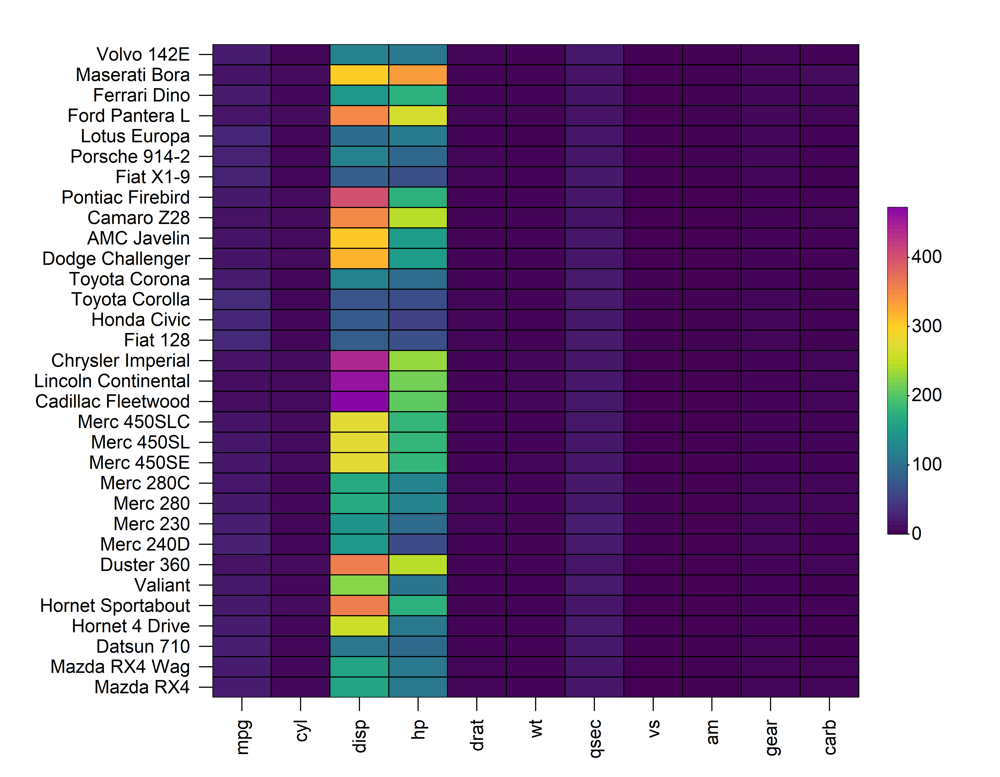
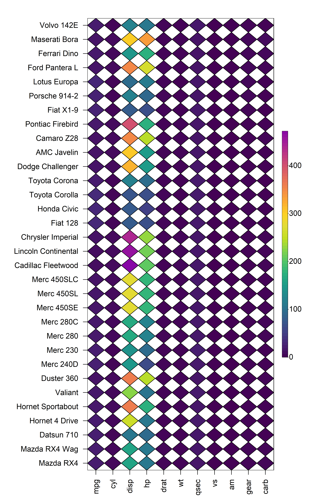

```{r, include = FALSE}
knitr::opts_chunk$set(
  collapse = TRUE,
  comment = "#>"
)
```

```{r, echo = FALSE, eval = FALSE}
img <- htmltools::img(src = knitr::image_uri("logo.png"), 
                      alt = 'logo', 
                      style = 'float:right; width:150px')
html <- htmltools::doRenderTags(img)
readr::write_lines(html, path = "logo.html")
```

## Overview

The key functions in **HeatmapR** are summarised below:

-   `heat_map()` creates the heatmaps
-   `heat_map_clust()` is used inside `heat_map()` to perform hierarchical clustering on the dataset using `stats::hclust()`
-   `heat_map_scale()` is used inside `heat_map()` to apply column-wise mean, z-score or range scaling to the dataset prior to constructing the heatmap.
-   `heat_map_layout()` allows you to create custom plot layouts to arrange multiple heatmaps.
-   `heat_map_save()` can be called prior to any `heat_map()` call to save a high resolution image.
-   `heat_map_record()` can be called after any `heat_map()` calls to record the current plot for saving to an R object.
-   `heat_map_complete()` can be called when creating complex layouts to indicate when the resulting layout should be saved to file using `heat_map_save()`.
-   `heat_map_reset()` resets all **HeatmapR** associated settings in case things are not working as they should.

## 1. Construct a Basic Heatmap

Constructing a heatmap is as simple loading the **HeatmapR** package and supplying your dataset to the `heat_map()` function. This will create a heatmap using the raw data and a default hybrid viridis colour scale.

```{r, echo = FALSE, eval = TRUE}
library(HeatmapR)
```

```{r, eval = FALSE}
library(HeatmapR)
heat_map(mtcars)
```

```{r, eval = FALSE, echo = FALSE}
heat_map_save(
  "vignettes/HeatmapR/HeatmapR-1.png",
  height = 7,
  width = 9,
  res = 500
)
heat_map(mtcars)
```

```{r echo = FALSE, out.width = '95%', fig.align="center"}

```

## 2. Handling of Values in `HeatmapR`

`HeatmapR` accepts any matrix-like data structure as input and is capable of handling any value types, including numeric, character, factor and missing (NA). Only numeric values are used when performing hierarchical clustering but non_numeric columns will still be included in the resulting heatmap. The colour for the cells in the heatmap is dependent on the type of value in each cell, colours for numeric data are selected from `cell_col_scale`, whilst colours for non-numeric data and missing values are selected from `cell_col_palette` and `cell_col_empty` respectively. Non-numeric columns will always be moved to the right hand side of the heatmap to distinguish them from numeric columns used for hierarchical clustering. The value of each cell can be displayed by setting `cell_text = TRUE`. Below is an example showing the handling of various data types within `heat_map()` using a modified version of the `iris` dataset which contains some missing values.

```{r, eval = TRUE, echo = FALSE}
set.seed(2022)
```

```{r, eval = FALSE}
# Modified subset of iris dataset with missing values
iris_sub <- iris[sample(1:nrow(iris), 25), ]
iris_sub[c(2, 19, 14, 7), 2] <- NA
iris_sub[c(4, 9, 17, 25), 3] <- NA

# Build heatmap
heat_map(
  iris_sub,
  cell_text = TRUE,
  cell_col_empty = "grey40",
  cell_col_scale = c(
    "yellow",
    "orange",
    "red",
    "black"
  ),
  cell_col_palette = c(
    "magenta",
    "blue",
    "green3"
  )
)
```

```{r, eval = FALSE, echo = FALSE}
heat_map_save(
  "vignettes/HeatmapR/HeatmapR-2.png",
  height = 7,
  width = 7,
  res = 500
)
iris_sub <- iris[sample(1:nrow(iris), 25), ]
iris_sub[c(2, 19, 14, 7), 2] <- NA
iris_sub[c(4, 9, 17, 25), 3] <- NA
heat_map(
  iris_sub,
  cell_text = TRUE,
  cell_col_empty = "grey40",
  cell_col_scale = c(
    "yellow",
    "orange",
    "red",
    "black"
  ),
  cell_col_palette = c(
    "magenta",
    "blue",
    "green3"
  )
)
```

```{r echo = FALSE, out.width = '95%', fig.align="center"}
knitr::include_graphics('HeatmapR/HeatmapR-2.png')
```

# 3. Cell Properties

`heat_map()` contains a family of `cell_` arguments which allow for the customisation of the shape, size, colour, borders and text of cells within a heatmap. 

## 3.1 Cell Shape

`heat_map()` supports different cell shapes through the `cell_shape` argument which can be set to either `"rect"` (default), `"circle"` or `"diamond"`. Alternatively, a matrix of shapes can be supplied to use different shapes for cells.

```{r, eval = FALSE}
heat_map(
  mtcars,
  cell_shape = "circle"
)
```

```{r, eval = FALSE, echo = FALSE}
heat_map_save(
  "vignettes/HeatmapR/HeatmapR-3.png",
  height = 11,
  width = 7,
  res = 500
)
heat_map(
  mtcars,
  cell_shape = "circle"
)
```

```{r echo = FALSE, out.width = '95%', fig.align="center"}
knitr::include_graphics('HeatmapR/HeatmapR-3.png')
```

```{r, eval = FALSE}
heat_map(
  mtcars,
  cell_shape = "diamond"
)
```

```{r, eval = FALSE, echo = FALSE}
heat_map_save(
  "vignettes/HeatmapR/HeatmapR-4.png",
  height = 11,
  width = 7,
  res = 500
)
heat_map(
  mtcars,
  cell_shape = "diamond"
)
```

```{r echo = FALSE, out.width = '95%', fig.align="center"}

```

## 3.2 Cell Size

The size of each cell is controlled through the `cell_size` argument. Setting `cell_size = TRUE` will scale the size of each cell based on its value. Alternatively, a matrix of the same dimensions and orientation as the input matrix can be supplied to control the size of the cells in heatmap.

```{r, eval = FALSE}
heat_map(
  mtcars,
  cell_shape = "circle",
  cell_size = TRUE
)
```

```{r, eval = FALSE, echo = FALSE}
heat_map_save(
  "vignettes/HeatmapR/HeatmapR-5.png",
  height = 11,
  width = 7,
  res = 500
)
heat_map(
  mtcars,
  cell_shape = "circle",
  cell_size = TRUE,
  legend_size = 1.5
)
```

```{r echo = FALSE, out.width = '95%', fig.align="center"}

```

## 3.3 Cell Colours

The colour of each cell is dependent on the type of data in that cell. For numeric data, the colours are selected from `cell_col_scale`, non-numeric values are selected from `cell_col_palette` and missing values are selected from `cell_col_empty`.


## 3.4 Cell Borders


## 3.5 Cell Annotation

```{r, eval = FALSE}
heat_map(
  mtcars,
  cell_text = TRUE,
  cell_text_font = 2,
  cell_text_col = "black",
  cell_text_col_alpha = 1,
  cell_col_alpha = 0.9,
  title = "mtcars"
)
```


# 4. Data Scaling


## 4.1 Types of Data Scaling

## 4.2 Scaling Rows

## 4.3 Scaling Columns


# 5. Bar Plots


## 5.1 Values

```{r, eval = FALSE}
heat_map(
  mtcars,
  bar_values_x = c(1:ncol(mtcars)),
  bar_size_x = 0.6,
  bar_values_y = c(1:nrow(mtcars)),
  bar_size_y = 1,
  title = "mtcars"
)
```

## 5.2 Customisation


# 6. Hierarchical Clustering

## 6.1 Dendrograms

## 6.2 Dendrogram Scaling

## 6.3 Tree size

## 6.4 Tree Cutting

## 6.5 Custom Distance Matrix

## 6.6 Cluster Labels


# 7. Legends

## 7.1 Cell Size Legend

## 7.2 Cell Colour Legend

## 7.3 Legend Size and Position


# 8. Layouts

## 8.1 Multiple Heatmaps

## 8.2 Layouts with other plots


# 9. Export

## 9.1 `heat_map_save()`


