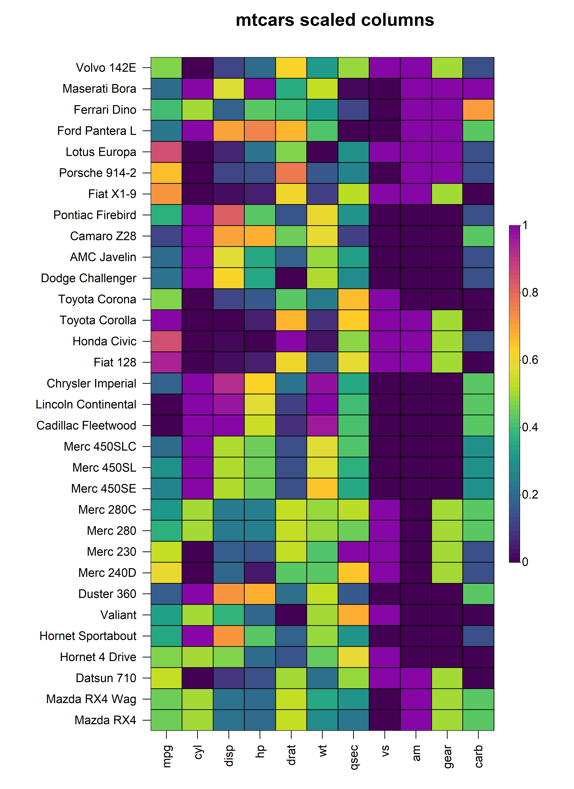
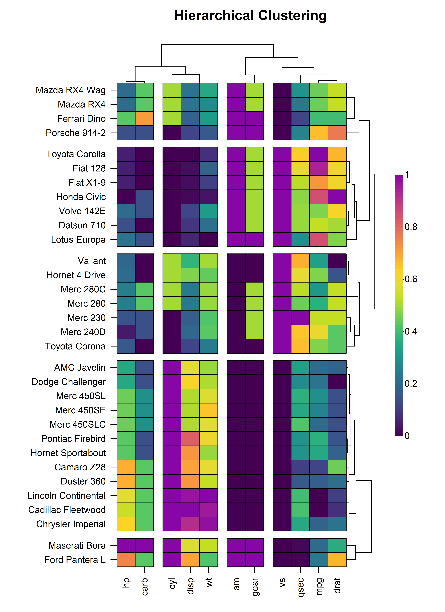

```{r, include = FALSE}
knitr::opts_chunk$set(
  collapse = TRUE,
  comment = "#>"
)
```

```{r, echo = FALSE, eval = FALSE}
img <- htmltools::img(src = knitr::image_uri("logo.png"), 
                      alt = 'logo', 
                      style = 'float:right; width:150px')
html <- htmltools::doRenderTags(img)
readr::write_lines(html, path = "logo.html")
```

## Overview

**HeatmapR** is a lightweight R package that uses base graphics to facilitate the creation of high quality complex heatmaps that can be easily arranged with other plots. In this vignette, we will explore the key features of `HeatmapR` and describe the usage of each of the key functions in `HeatmapR` as summarised below:

-   `heat_map()` convenient wrapper around all `HeatmapR` functions providing an intuitive way to create complex heatmaps using base graphics.
-   `heat_map_clust()` is used inside `heat_map()` to perform hierarchical clustering on the dataset using `stats::hclust()`.
-   `heat_map_scale()` is used inside `heat_map()` to apply column- or row-wise mean, z-score or range scaling to the dataset prior to constructing the heatmap.
-   `heat_map_layout()` allows you to create custom plot layouts to arrange multiple heatmaps.
-   `heat_map_save()` can be called prior to any `heat_map()` call to save a high resolution image.
-   `heat_map_record()` can be called after any `heat_map()` calls to record the current plot for saving to an R object.
-   `heat_map_complete()` can be called when creating complex layouts to indicate when the resulting layout should be saved to file using `heat_map_save()`.
-   `heat_map_reset()` resets all **HeatmapR** associated settings in case things are not working as they should.

## 1. Construct a Basic Heatmap

Constructing a heatmap is as simple loading the **HeatmapR** package and supplying your dataset to the `heat_map()` function. The constructed heatmap will be in the same orientation as the input data and each numeric cell in the heatmap will be coloured using the colour scale supplied to `cell_col_scale`. By default, `heat_map()` uses a hybrid colour blind friendly `viridis` palette to offer high visual contrast.

```{r, echo = FALSE, eval = TRUE}
library(HeatmapR)
```

```{r, eval = FALSE}
library(HeatmapR)
heat_map(mtcars)
```

```{r, eval = FALSE, echo = FALSE}
heat_map_save(
  "vignettes/HeatmapR/HeatmapR-1.png",
  height = 7,
  width = 9,
  res = 500
)
heat_map(mtcars)
```

```{r echo = FALSE, out.width = '95%', fig.align="center"}
knitr::include_graphics('HeatmapR/HeatmapR-1.png')
```

## 2. Cell Properties

`heat_map()` contains a family of `cell_` arguments which allow for the customisation of the shape, size, colour, borders and text of cells within a heatmap. In the examples below, we will apply the same properties to every cell within the heatmap, but it is also possible to modify these properties per cell by supplying a matrix matching the dimensionality and orientation of the input matrix.

### 2.1 Cell Shape

`heat_map()` supports different cell shapes through the `cell_shape` argument which can be set to either `"rect"` (default), `"circle"` or `"diamond"`.

```{r, eval = FALSE}
heat_map(
  mtcars,
  cell_shape = "circle"
)
```

```{r, eval = FALSE, echo = FALSE}
heat_map_save(
  "vignettes/HeatmapR/HeatmapR-3.png",
  height = 11,
  width = 7,
  res = 500
)
heat_map(
  mtcars,
  cell_shape = "circle"
)
```

```{r echo = FALSE, out.width = '95%', fig.align="center"}
knitr::include_graphics('HeatmapR/HeatmapR-3.png')
```

```{r, eval = FALSE}
heat_map(
  mtcars,
  cell_shape = "diamond"
)
```

```{r, eval = FALSE, echo = FALSE}
heat_map_save(
  "vignettes/HeatmapR/HeatmapR-4.png",
  height = 11,
  width = 7,
  res = 500
)
heat_map(
  mtcars,
  cell_shape = "diamond"
)
```

```{r echo = FALSE, out.width = '95%', fig.align="center"}
knitr::include_graphics('HeatmapR/HeatmapR-4.png')
```

### 2.2 Cell Size

The size of each cell is controlled through the `cell_size` argument. Setting `cell_size = TRUE` will scale the size of each cell based on its value in the input matrix. Alternatively, users can supply a separate matrix of the same dimensionality and orientation as the input matrix to control the size of the cells independently of their colour.

```{r, eval = FALSE}
heat_map(
  mtcars,
  cell_shape = "circle",
  cell_size = TRUE
)
```

```{r, eval = FALSE, echo = FALSE}
heat_map_save(
  "vignettes/HeatmapR/HeatmapR-5.png",
  height = 11,
  width = 7,
  res = 500
)
heat_map(
  mtcars,
  cell_shape = "circle",
  cell_size = TRUE,
  legend_size = 1.5
)
```

```{r echo = FALSE, out.width = '95%', fig.align="center"}
knitr::include_graphics('HeatmapR/HeatmapR-5.png')
```

### 2.3 Cell Colours

The colour of each cell in the heatmap is dependent on the type of data in that cell. Cells containing numeric values will be assigned colours based on the continuous colour scale supplied to `cell_col_scale`, whilst cells containing non-numeric values will be assigned colours from the discrete colour palette supplied to `cell_col_palette`. Missing values of the form `NA` are also supported and the colour of cells containing missing values can be controlled through the `cell_col_empty` argument. The `cell_col_alpha` argument accepts values ranging from zero (transparent) to one (solid) to for fine control over the transparency of the colour in each cell of the heatmap. In the example below, we will demonstrate the handling of different data types within `heat_map()`  using a modified subset of the `iris` dataset where additional missing values have been introduced:

```{r, eval = TRUE, echo = FALSE}
set.seed(2022)
```

```{r, eval = FALSE}
# Modified subset of iris dataset with missing values
iris_sub <- iris[sample(1:nrow(iris), 25), ]
iris_sub[c(2, 19, 14, 7), 2] <- NA
iris_sub[c(4, 9, 17, 25), 3] <- NA

# Build heatmap
heat_map(
  iris_sub,
  cell_text = TRUE,
  cell_col_empty = "grey40",
  cell_col_scale = c(
    "yellow",
    "orange",
    "red",
    "black"
  ),
  cell_col_palette = c(
    "magenta",
    "blue",
    "green3"
  ),
  cell_col_alpha = 1
)
```

```{r, eval = FALSE, echo = FALSE}
heat_map_save(
  "vignettes/HeatmapR/HeatmapR-2.png",
  height = 7,
  width = 7,
  res = 500
)
iris_sub <- iris[sample(1:nrow(iris), 25), ]
iris_sub[c(2, 19, 14, 7), 2] <- NA
iris_sub[c(4, 9, 17, 25), 3] <- NA
heat_map(
  iris_sub,
  cell_text = TRUE,
  cell_col_empty = "grey40",
  cell_col_scale = c(
    "yellow",
    "orange",
    "red",
    "black"
  ),
  cell_col_palette = c(
    "magenta",
    "blue",
    "green3"
  ),
  cell_col_alpha = 1
)
```

```{r echo = FALSE, out.width = '95%', fig.align="center"}
knitr::include_graphics('HeatmapR/HeatmapR-2.png')
```

### 2.4 Cell Borders

The borders of every cell within the constructed heatmap can also be customised using the `cell_border_line_type`, `cell_border_line_width`, `cell_border_line_col` and `cell_border_line_col_alpha` arguments.

```{r, eval = FALSE}
heat_map(
  mtcars,
  cell_border_line_type = 3,
  cell_border_line_width = 2,
  cell_border_line_col = "red",
  cell_border_line_col_alpha = 1
)
```

```{r, eval = FALSE, echo = FALSE}
heat_map_save(
  "vignettes/HeatmapR/HeatmapR-6.png",
  height = 11,
  width = 7,
  res = 500
)
heat_map(
  mtcars,
  cell_border_line_type = 3,
  cell_border_line_width = 2,
  cell_border_line_col = "red",
  cell_border_line_col_alpha = 1
)
```

```{r echo = FALSE, out.width = '95%', fig.align="center"}
knitr::include_graphics('HeatmapR/HeatmapR-6.png')
```

### 2.5 Cell Text

The values of every cells within the constructed heatmap can be displayed by setting `cell_text = TRUE`. By default, numeric values are rounded to two decimal places but this can be changed through the `round` argument. The text displayed in each cell can easily be customised using the `cell_text_size`, `cell_text_font`, `cell_text_col` and `cell_text_col_alpha` arguments. 

```{r, eval = FALSE}
heat_map(
  mtcars,
  cell_text = TRUE,
  cell_text_size = 1,
  cell_text_font = 2,
  cell_text_col = "black",
  cell_text_col_alpha = 1,
  title = "mtcars"
)
```

```{r, eval = FALSE, echo = FALSE}
heat_map_save(
  "vignettes/HeatmapR/HeatmapR-7.png",
  height = 11,
  width = 8,
  res = 500
)
heat_map(
  mtcars,
  cell_text = TRUE,
  cell_text_size = 1,
  cell_text_font = 2,
  cell_text_col = "black",
  cell_text_col_alpha = 1,
  cell_col_alpha = 0.9,
  title = "mtcars"
)
```

```{r echo = FALSE, out.width = '95%', fig.align="center"}
knitr::include_graphics('HeatmapR/HeatmapR-7.png')
```

## 3. Data Scaling

In the above heatmap, it is very clear that each of the columns of the input matrix are on completely different scales, making it difficult to visualise differences in columns with very small values. In order to represent each column on the same scale, we can apply a form of data scaling through the `scale_method` argument either to each row or column as specified by the `scale` argument. Currently, `heat_map()` has internal support for `"mean"`, `"range"` and `"z-score"` scaling methods that can be applied to either the rows or columns of the input matrix.

### 3.1 Scaling Columns

To scale the values in every column, simply set `scale = "column` and specify the scaling method through the `scale_method` argument. For example, to apply range scaling to every column in the `mtcars` dataset:

```{r, eval = FALSE}
heat_map(
  mtcars,
  scale = "column",
  scale_method = "range",
  title = "mtcars scaled columns"
)
```

```{r, eval = FALSE, echo = FALSE}
heat_map_save(
  "vignettes/HeatmapR/HeatmapR-8.png",
  height = 11,
  width = 8,
  res = 500
)
heat_map(
  mtcars,
  scale = "column",
  scale_method = "range",
  title = "mtcars scaled columns"
)
```

```{r echo = FALSE, out.width = '95%', fig.align="center"}

```

### 3.2 Scaling Rows

Similarly, in instances where it is more appropriate to scale the values in each row, we can set `scale = "row"` and pass the required scaling method to `scale_method`. For example, to apply z-score scaling to every row in the `mtcars` dataset:

```{r, eval = FALSE}
heat_map(
  mtcars,
  scale = "row",
  scale_method = "zscore",
  title = "mtcars scaled rows"
)
```

```{r, eval = FALSE, echo = FALSE}
heat_map_save(
  "vignettes/HeatmapR/HeatmapR-9.png",
  height = 11,
  width = 8,
  res = 500
)
heat_map(
  mtcars,
  scale = "row",
  scale_method = "zscore",
  title = "mtcars scaled rows"
)
```

```{r echo = FALSE, out.width = '95%', fig.align="center"}
knitr::include_graphics('HeatmapR/HeatmapR-9.png')
```

## 4. Bar Plots

In addition to the cells of the heatmap, `heat_map()` supports the display of additional values in bar plots on either axis of the heatmap. To add bar plots to the heatmap, users should supply the (named) values to `bar_values_x` and/or `bar_values_y` in the same order as the original input matrix. The bar plots will be displayed on the opposite side to the axis text and size of the bar plot (i.e. height or width) can be controlled through the `bar_size_x` and `bar_size_y` arguments. The colours of the bars and borders can be customised using the `bar_fill_` and `bar_line_` family of arguments. In the example below, we demonstrate the addition of bar plots to the x and y axes of a heatmap constructed using the `mtcars` dataset:

```{r, eval = FALSE}
heat_map(
  mtcars,
  bar_values_x = 1:ncol(mtcars),
  bar_size_x = 0.5,
  bar_fill_x = rainbor(ncol(mtcars)),
  bar_line_col_x = "black",
  bar_values_y = 1:nrow(mtcars),
  bar_size_y = 0.8,
  bar_fill_y = rainbor(ncol(mtcars)),
  bar_line_col_y = "black",
  title = "heatmap with bar plots"
)
```

```{r, eval = FALSE, echo = FALSE}
heat_map_save(
  "vignettes/HeatmapR/HeatmapR-10.png",
  height = 11,
  width = 8,
  res = 500
)
heat_map(
  mtcars,
  bar_values_x = 1:ncol(mtcars),
  bar_size_x = 0.5,
  bar_fill_x = rainbow(ncol(mtcars)),
  bar_line_col_x = "black",
  bar_values_y = 1:nrow(mtcars),
  bar_size_y = 0.8,
  bar_fill_y = rainbow(nrow(mtcars)),
  bar_line_col_y = "black",
  title = "heatmap with bar plots"
)
```

```{r echo = FALSE, out.width = '95%', fig.align="center"}
knitr::include_graphics('HeatmapR/HeatmapR-10.png')
```

## 5. Hierarchical Clustering

`heat_map()` also supports hierarchical clustering using the conventional `stats::hclust()` to construct dendrograms and `stats::cutree()` to partition the dendrograms into distinct clusters. The `dist_method` and `clust_method` arguments allow for control over the distance metric to use for hierarchical clustering (any method supported by `stats::dist()`) and the agglomeration method to use (any method supported by `stats::hclust()`).

### 5.1 Dendrograms

Dendrograms can be added to the x and/or y axis using the `tree`, `tree_x` or `tree_y` arguments. The `tree` argument indicates whether dendrograms should be drawn for the `"x"`, `"y"` or `"both"` axes. Alternatively, the `tree_x` or `tree_y` arguments can be set to `TRUE` to include dendrograms on the x or y axes respectively. The `tree_x` and `tree_y` arguments also accept objects of class `dist` or `hclust` to allow for custom dendrograms using unsupported distance metrics or agglomeration methods. The `tree_size_x` and `tree_size_y` arguments are scalars to control the height or width of the dendrograms on the x and y axes respectively. The `tree_scale_x` and `tree_scale_y` arguments can be used to scale the branch heights of the dendrogram to be the same height at each level allowing for better visualisation of relationships in large heatmaps.

```{r, eval = FALSE}
heat_map(
  mtcars,
  scale = "column",
  dist_method = "euclidean",
  clust_method = "complete",
  tree_x = TRUE,
  tree_size_x = 0.4,
  tree_y = TRUE,
  tree_size_y = 0.8,
  title = "Dendrograms"
)
```

```{r, eval = FALSE, echo = FALSE}
heat_map_save(
  "vignettes/HeatmapR/HeatmapR-11.png",
  height = 11,
  width = 8,
  res = 500
)
heat_map(
  mtcars,
  scale = "column",
  dist_method = "euclidean",
  clust_method = "complete",
  tree_x = TRUE,
  tree_size_x = 0.4,
  tree_scale_x = TRUE,
  tree_y = TRUE,
  tree_size_y = 0.8,
  title = "Dendrograms"
)
```

```{r echo = FALSE, out.width = '95%', fig.align="center"}

```

### 5.2 Clustering

The dendrograms on either axis can be optionally cut to reveal clusters in the data. Dendrogram cutting is performed via the `tree_cut_x` and `tree_cut_y` arguments which accept either a fixed number of clusters or a proportion of the total dendrogram height where the cut should be made. The clusters can be spatially separated by introducing splits in the heatmap using the `tree_split_x` and `tree_split_y` arguments which are scalars that control the height or width of the splits.

```{r, eval = FALSE}
heat_map(
  mtcars,
  scale = "column",
  dist_method = "euclidean",
  clust_method = "complete",
  tree_x = TRUE,
  tree_size_x = 0.4,
  tree_cut_x = 4,
  tree_split_x = 1,
  tree_y = TRUE,
  tree_size_y = 0.8,
  tree_cut_y = 5,
  tree_split_y = 1,
  title = "Hierarchical Clustering"
)
```

```{r, eval = FALSE, echo = FALSE}
heat_map_save(
  "vignettes/HeatmapR/HeatmapR-12.png",
  height = 11,
  width = 8,
  res = 500
)
heat_map(
  mtcars,
  scale = "column",
  dist_method = "euclidean",
  clust_method = "complete",
  tree_x = TRUE,
  tree_size_x = 0.4,
  tree_cut_x = 4,
  tree_split_x = 1,
  tree_y = TRUE,
  tree_size_y = 0.8,
  tree_cut_y = 5,
  tree_split_y = 1,
  title = "Hierarchical Clustering"
)
```

```{r echo = FALSE, out.width = '95%', fig.align="center"}

```

In addition to heatmap splitting, `heat_map()` also supports the labelling of clusters through the `tree_label_x`, `tree_label_text_x`, `tree_label_y` and `tree_label_text_y` arguments.

```{r, eval = FALSE}
heat_map(
  mtcars,
  scale = "column",
  tree_size_x = 0.4,
  tree_cut_x = 4,
  tree_split_x = 1,
  tree_label_x = TRUE,
  tree_label_size_x = 1.4,
  tree_label_text_x = c(1:4),
  tree_label_col_x = c(
    "red",
    "blue", 
    "green", 
    "magenta"
  ),
  tree_y = TRUE,
  tree_size_y = 0.8,
  tree_cut_y = 5,
  tree_split_y = 1,
  tree_label_y = TRUE,
  tree_label_size_y = 1,
  tree_label_text_y = c(1:5),
  tree_label_col_y = c(
    "red",
    "blue", 
    "green", 
    "magenta",
    "orange"
  ),
  title = "Cluster Labels"
)
```

```{r, eval = FALSE, echo = FALSE}
heat_map_save(
  "vignettes/HeatmapR/HeatmapR-13.png",
  height = 11,
  width = 8,
  res = 500
)
heat_map(
  mtcars,
  scale = "column",
  tree_size_x = 0.4,
  tree_cut_x = 4,
  tree_split_x = 1,
  tree_label_x = TRUE,
  tree_label_size_x = 1.4,
  tree_label_text_x = c(1:4),
  tree_label_col_x = c(
    "red",
    "blue", 
    "green", 
    "magenta"
  ),
  tree_y = TRUE,
  tree_size_y = 0.8,
  tree_cut_y = 5,
  tree_split_y = 1,
  tree_label_y = TRUE,
  tree_label_size_y = 1,
  tree_label_text_y = c(1:5),
  tree_label_col_y = c(
    "red",
    "blue", 
    "green", 
    "magenta",
    "orange"
  ),
  title = "Cluster Labels"
)
```

```{r echo = FALSE, out.width = '95%', fig.align="center"}
knitr::include_graphics('HeatmapR/HeatmapR-13.png')
```

## 6. Legends

`heat_map()` will automatically add legends for the colour scale and size of the cells in the heatmap. The `legend` argument controls the type(s) of legends to display including the `"colour"`, `"shape"` or `"both"`. The space available to the legend can be tweaked using the `legend_size` argument, and the size of the colour scale legend can be controlled through the `legend_col_scale_size` argument. The titles and text displayed in the legend(s) are also fully customisable using the the `legend_title_` and `legend_text_` family of arguments.

```{r, eval = FALSE}
heat_map(
  mtcars,
  scale = TRUE,
  tree_x = TRUE,
  tree_y = TRUE,
  cell_shape = "circle",
  cell_size = TRUE,
  legend = TRUE,
  legend_size = 1.5,
  legend_col_scale_size = 1.2,
  legend_title = c("colour", "size"),
  title = "Legends"
)
```

```{r, eval = FALSE, echo = FALSE}
heat_map_save(
  "vignettes/HeatmapR/HeatmapR-17.png",
  height = 11,
  width = 8,
  res = 500
)
heat_map(
  mtcars,
  scale = TRUE,
  tree_x = TRUE,
  tree_size_x = 0.6,
  tree_y = TRUE,
  cell_shape = "circle",
  cell_size = TRUE,
  legend = TRUE,
  legend_size = 1.5,
  legend_col_scale_size = 1.2,
  legend_title = c("colour", "size"),
  title = "Legends"
)
```

```{r echo = FALSE, out.width = '95%', fig.align="center"}

```

## 7. Complex Layouts

`HeatmapR` supports the arrangement of multiple heatmaps in complex layouts using `heat_map_custom()`. `heat_map_custom()` is called prior to plotting to open the appropriate graphics device and set the desired layout before adding the heatmaps. Once the layout is complete, a call is made to `heat_map_complete()` to reset all `heat_map()` associated settings. The `layout` argument can be either a vector indicating the desired number of rows and columns or a mtrix defining a more complex layout. For example, if we want to split different car brands into separate heatmaps and arrange them:

```{r, eval = FALSE}
heat_map_custom(
  popup = TRUE,
  popup_size = c(10, 15),
  layout = matrix(
    c(1,1,2,2,1,1,3,3),
    ncol = 4,
    nrow = 2,
    byrow = TRUE
  )
)
heat_map(
  mtcars[grepl("Merc", rownames(mtcars)),],
  title = "Mercedes"
)
heat_map(
  mtcars[grepl("Mazda|Toyota", rownames(mtcars)),],
  title = "Mazda | Toyota"
)
heat_map(
  mtcars[grepl("Hornet|Datsun|Volvo", rownames(mtcars)),],
  title = "Hornet | Datsun | Volvo"
)
heat_map_complete()
```

```{r, eval = FALSE, echo = FALSE}
heat_map_save(
  "vignettes/HeatmapR/HeatmapR-14.png",
  height = 5,
  width = 12,
  res = 500,
  layout = matrix(
    c(1,1,2,2,1,1,3,3),
    ncol = 4,
    nrow = 2,
    byrow = TRUE
  )
)
heat_map(
  mtcars[grepl("Merc", rownames(mtcars)),],
  title = "Mercedes"
)
heat_map(
  mtcars[grepl("Mazda|Toyota", rownames(mtcars)),],
  title = "Mazda | Toyota"
)
heat_map(
  mtcars[grepl("Hornet|Datsun|Volvo", rownames(mtcars)),],
  title = "Hornet | Datsun | Volvo"
)
heat_map_complete()
```

```{r echo = FALSE, out.width = '95%', fig.align="center"}

```

`HeatmapR` also supports layouts with other plots generated using base graphics. For example, we could arrange a heatmap with a scatterplot and a boxplot. 

```{r, eval = FALSE}
heat_map_custom(
  popup = TRUE,
  popup_size = c(10, 15),
  layout = matrix(
    c(1,1,2,2,1,1,3,3),
    ncol = 4,
    nrow = 2,
    byrow = TRUE
  )
)
heat_map(
  mtcars,
  title = "mtcars"
)
plot(
  mtcars[, c("disp", "hp")],
  xlab = "Displacement",
  ylab = "Horsepower",
  main = "mtcars: Displacement vs Horsepower",
  pch = 16,
  col = "black"
)
boxplot(
  mtcars[, "disp"],
  main = "Displacement",
  xlab = "Displacement (cu.in.)",
  horizontal = TRUE
)
heat_map_complete()
```

```{r, eval = FALSE, echo = FALSE}
heat_map_save(
  "vignettes/HeatmapR/HeatmapR-15.png",
  height = 8,
  width = 10,
  res = 500,
  layout = matrix(
    c(1,1,2,2,1,1,3, 3),
    ncol = 4,
    nrow = 2,
    byrow = TRUE
  )
)
heat_map(
  mtcars,
  scale = "column",
  cell_size = TRUE,
  legend_size = 1.5,
  title = "mtcars"
)
plot(
  mtcars[, c("disp", "hp")],
  xlab = "Displacement",
  ylab = "Horsepower",
  main = "mtcars: Displacement vs Horsepower",
  pch = 16,
  col = "black"
)
abline(
  lm(hp ~ disp, data = mtcars),
  col = "red",
  lty = 2
)
boxplot(
  mtcars[, "disp"],
  main = "Displacement",
  xlab = "Displacement (cu.in.)",
  horizontal = TRUE
)
heat_map_complete()
```

```{r echo = FALSE, out.width = '95%', fig.align="center"}
knitr::include_graphics('HeatmapR/HeatmapR-15.png')
```

## 8. Export

`HeatmapR` supports the export of high resolution images using `heat_map_save()` which allows control over the dimensions and resolution of the exported image. 

```{r, eval = FALSE}
heat_map_save(
  "mtcars.png",
  height = 9.5,
  width = 5.7,
  res = 500
)
heat_map(
  mtcars,
  scale = "column",
  scale_method = "range",
  tree_x = TRUE,
  tree_y = TRUE,
  tree_cut_x = 4,
  tree_cut_y = 12,
  cell_size = TRUE,
  cell_shape = "circle",
  title = "mtcars"
)
heat_map_complete()
```

```{r, eval = FALSE, echo = FALSE}
heat_map_save(
  "vignettes/HeatmapR/HeatmapR-16.png",
  height = 9.5,
  width = 5.7,
  res = 500
)
heat_map(
  mtcars,
  scale = "column",
  scale_method = "range",
  tree_x = TRUE,
  tree_y = TRUE,
  tree_cut_x = 4,
  tree_cut_y = 12,
  tree_size_x = 0.6,
  cell_size = TRUE,
  cell_shape = "circle",
  title = "mtcars"
)
heat_map_complete()
```

```{r echo = FALSE, out.width = '95%', fig.align="center"}

```

## 10. Summary

`HeatmapR` is a lightweight R package built on base graphics that allows for the creation of high resolution complex heatmaps that can be arranged in sophisticated layouts with other plot objects. 
