```{r, include = FALSE}
knitr::opts_chunk$set(
  collapse = TRUE,
  comment = "#>"
)
```

```{r, echo = FALSE, eval = FALSE}
img <- htmltools::img(src = knitr::image_uri("logo.png"), 
                      alt = 'logo', 
                      style = 'float:right; width:150px')
html <- htmltools::doRenderTags(img)
readr::write_lines(html, path = "logo.html")
```

## Overview
The key functions in **heatmapr** are summarised below:

- `heat_map()` creates the heatmaps
- `heat_map_clust()` is used inside `heat_map()` to perform hierarchical clustering on the dataset using `stats::hclust()`
- `heat_map_scale()` is used inside `heat_map()` to apply column-wise mean, z-score or range scaling to the dataset prior to constructing the heatmap.
- `heat_map_layout()` allows you to create custom plot layouts to arrange multiple heatmaps.
- `heat_map_save()` can be called prior to any `heat_map()` call to save a high resolution image.
- `heat_map_record()` can be called after any `heat_map()` calls to record the current plot for saving to an R object.
- `heat_map_complete()` can be called when creating complex layouts to indicate when the resulting layout should be saved to file using `heat_map_save()`.
- `heat_map_reset()` resets all **heatmapr** associated settings in case things are not working as they should.

## 1. Construct a Basic Heatmap

Constructing a heatmap is as simple loading the **heatmapr** package and supplying your dataset to the `heat_map()` function. This will create a heatmap using the raw data and a default red-green colour scale.

```{r, echo = FALSE, eval = TRUE}
library(heatmapr)
```

```{r, eval = FALSE}
library(heatmapr)
heat_map(mtcars)
```

```{r, eval = FALSE, echo = FALSE}
heat_map_save("vignettes/heatmapr/heatmapr-1.png",
              height = 7,
              width = 10,
              res = 500)
heat_map(mtcars)
```

```{r echo = FALSE, out.width = '95%', fig.align="center"}
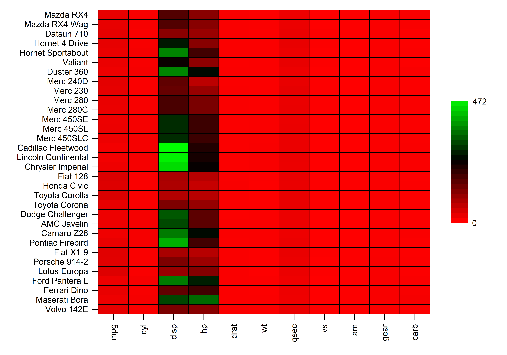
```

## 2. Column-Wise Scaling

The heatmap above is not very informative due to each of the column being on vastly different scales. `heat_map()` can perform column-wise range, mean or z-score scaling using `heat_map_scale()` to help improve the visualisation of the data. The type of scaling to perform can be controlled through the `scale` argument.

## 2.1 Range Scaling

The `range` scaling method takes each value in a column, subtracts the minimum value in that column and divides the result by the range of that column. This results in the data being rescaled to have values between 0 and 1.

```{r, eval = FALSE}
heat_map(mtcars, 
         scale = "range")
```

```{r, eval = FALSE, echo = FALSE}
heat_map_save("vignettes/heatmapr/heatmapr-2.png",
              height = 7,
              width = 10,
              res = 500)
heat_map(mtcars, scale = "range")
```

```{r echo = FALSE, out.width = '95%', fig.align="center"}
knitr::include_graphics('heatmapr/heatmapr-2.png')
```

## 2.2 Mean Scaling

The `mean` scaling method takes each value in a column, subtracts the mean value in that column and divides the result by the range of that column.

```{r, eval = FALSE}
heat_map(mtcars, 
         scale = "mean")
```

```{r, eval = FALSE, echo = FALSE}
heat_map_save("vignettes/heatmapr/heatmapr-3.png",
              height = 7,
              width = 10,
              res = 500)
heat_map(mtcars, scale = "mean")
```

```{r echo = FALSE, out.width = '95%', fig.align="center"}
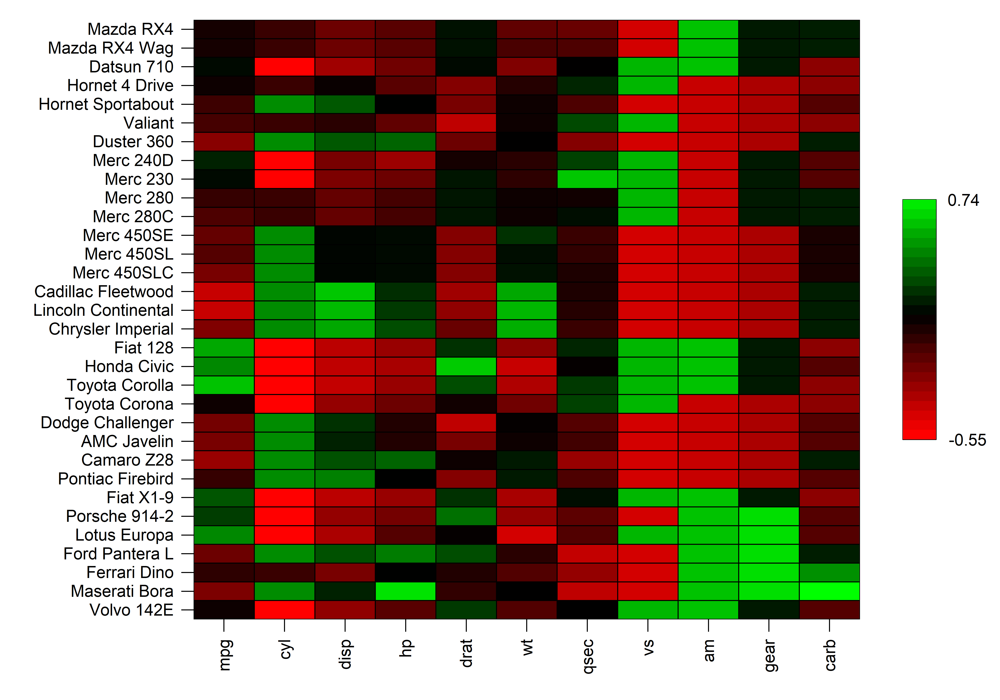
```

## 2.3 Z-Score Scaling

The `z-score` scaling method takes each value in a column, subtracts the mean value in that column and divides the result by the standard deviation of that column.

```{r, eval = FALSE}
heat_map(mtcars, 
         scale = "zscore")
```

```{r, eval = FALSE, echo = FALSE}
heat_map_save("vignettes/heatmapr/heatmapr-4.png",
              height = 7,
              width = 10,
              res = 500)
heat_map(mtcars, scale = "zscore")
```

```{r echo = FALSE, out.width = '95%', fig.align="center"}
knitr::include_graphics('heatmapr/heatmapr-4.png')
```

## 3. Hierarchical Clustering

`heat_map()` can also perform hierarchical clustering using the `heat_map_clust()` function. `heat_map()` supports performing hierarchical clustering on both rows and columns through the `cluster` argument. In `heat_map()` hierachical clustering is always performed post data scaling and the data is automatically reordered based on the clustering result.

## 3.1 Rows

```{r, eval = FALSE}
heat_map(mtcars, 
         scale = "range",
         cluster = "row")
```

```{r, eval = FALSE, echo = FALSE}
heat_map_save("vignettes/heatmapr/heatmapr-5.png",
              height = 7,
              width = 10,
              res = 500)
heat_map(mtcars, 
         scale = "range",
         cluster = "row")
```

```{r echo = FALSE, out.width = '95%', fig.align="center"}
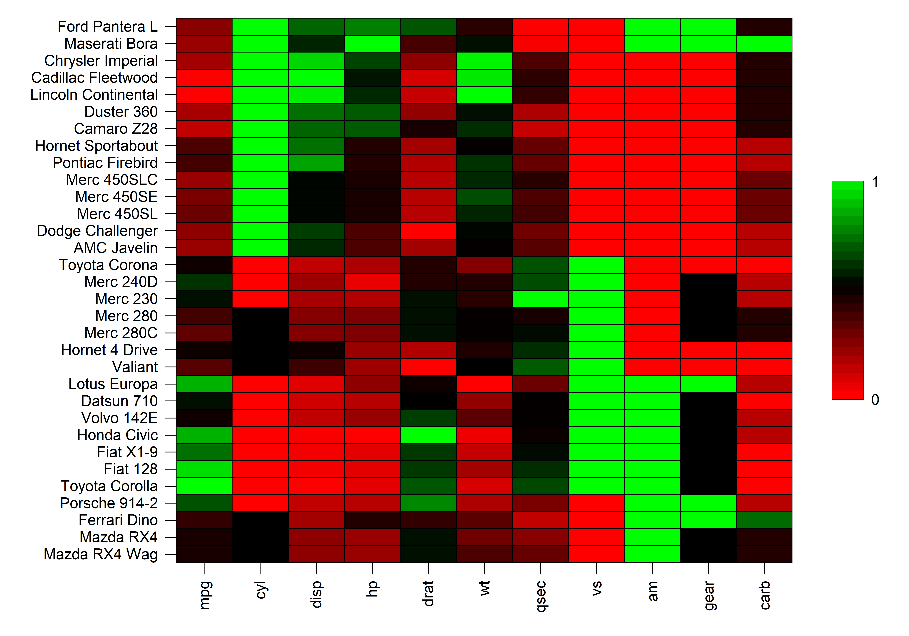
```

## 3.2 Columns

```{r, eval = FALSE}
heat_map(mtcars, 
         scale = "range",
         cluster = "column")
```

```{r, eval = FALSE, echo = FALSE}
heat_map_save("vignettes/heatmapr/heatmapr-6.png",
              height = 7,
              width = 10,
              res = 500)
heat_map(mtcars, 
         scale = "range",
         cluster = "column")
```

```{r echo = FALSE, out.width = '95%', fig.align="center"}
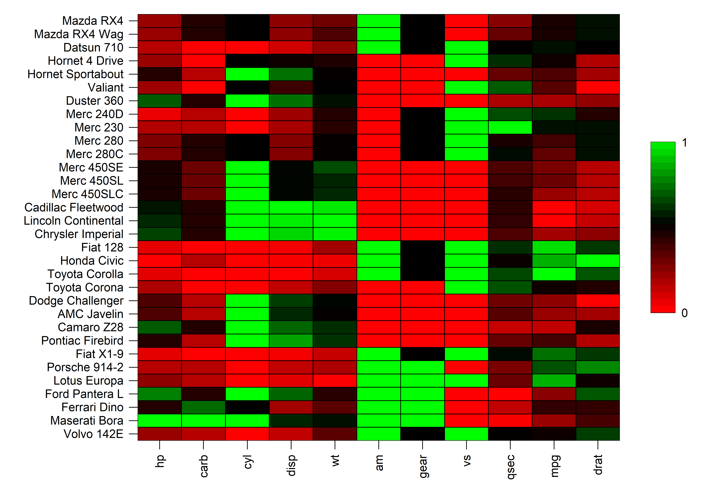
```

## 3.3 Rows and Columns

```{r, eval = FALSE}
heat_map(mtcars, 
         scale = "range",
         cluster = "both")
```

```{r, eval = FALSE, echo = FALSE}
heat_map_save("vignettes/heatmapr/heatmapr-7.png",
              height = 7,
              width = 10,
              res = 500)
heat_map(mtcars, 
         scale = "range",
         cluster = "both")
```

```{r echo = FALSE, out.width = '95%', fig.align="center"}
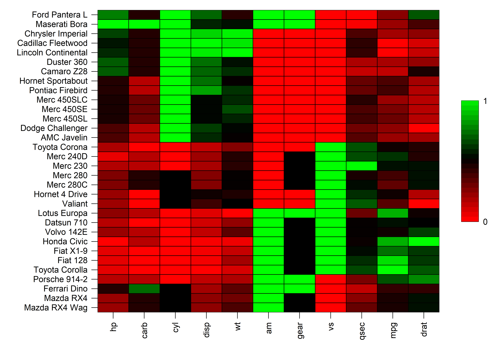
```

## 4. Dendrograms

In addition to reordering data post hierarchical clustering, `heat_map()` also has support for displaying dendrograms through its `dendrogram` argument. The `dendrogram_scale` argument can be used to scale the branch heights to be the same so that it is easier to see the relationships between the rows or columns.

## 4.1 Rows

```{r, eval = FALSE}
heat_map(mtcars, 
         scale = "range",
         dendrogram = "row")
```

```{r, eval = FALSE, echo = FALSE}
heat_map_save("vignettes/heatmapr/heatmapr-8.png",
              height = 7,
              width = 10,
              res = 500)
heat_map(mtcars, 
         scale = "range",
         dendrogram = "row")
```

```{r echo = FALSE, out.width = '95%', fig.align="center"}
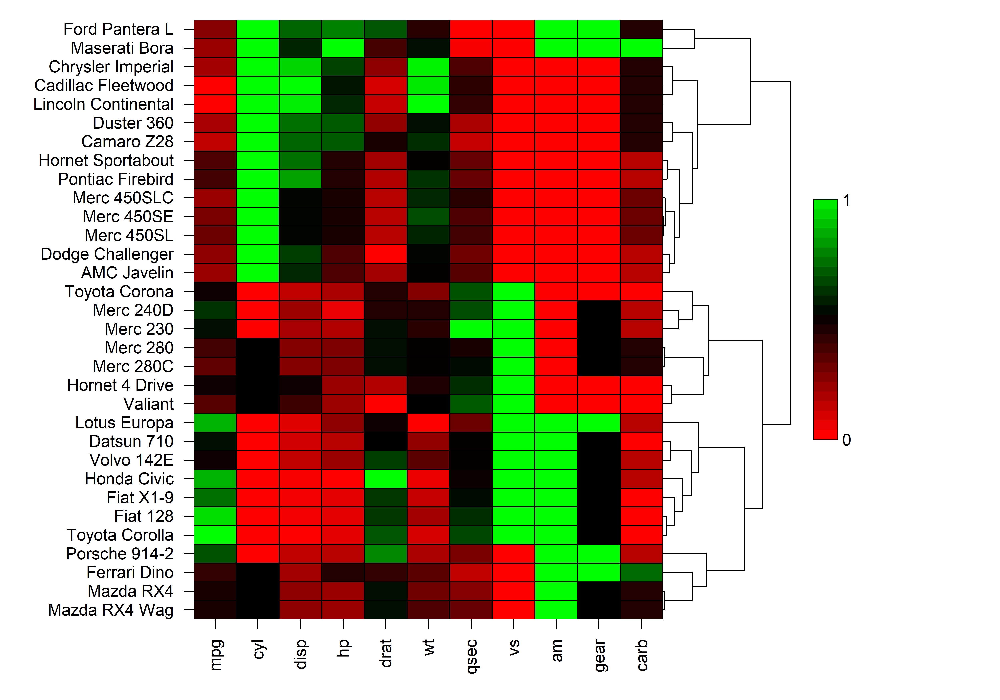
```

## 4.2 Columns

```{r, eval = FALSE}
heat_map(mtcars, 
         scale = "range",
         dendrogram = "column")
```

```{r, eval = FALSE, echo = FALSE}
heat_map_save("vignettes/heatmapr/heatmapr-9.png",
              height = 7,
              width = 10,
              res = 500)
heat_map(mtcars, 
         scale = "range",
         dendrogram = "column")
```

```{r echo = FALSE, out.width = '95%', fig.align="center"}
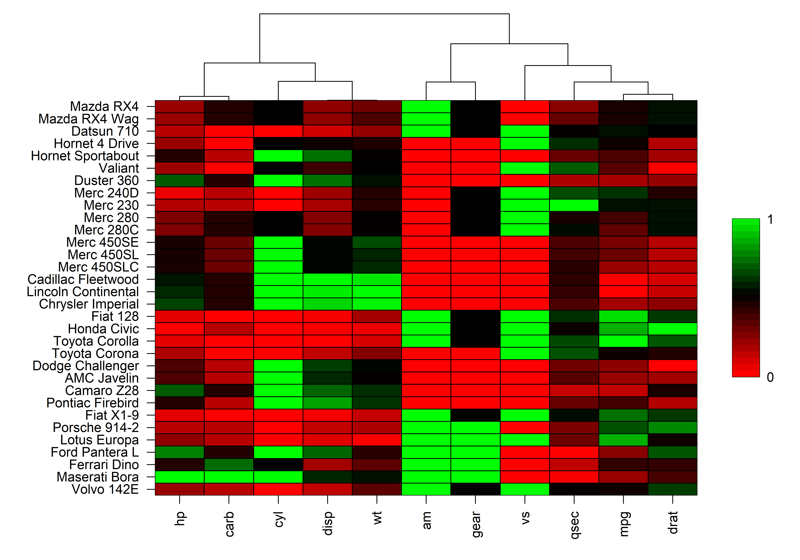
```

## 4.3 Rows and Columns

```{r, eval = FALSE}
heat_map(mtcars, 
         scale = "range",
         dendrogram = "both")
```

```{r, eval = FALSE, echo = FALSE}
heat_map_save("vignettes/heatmapr/heatmapr-10.png",
              height = 7,
              width = 10,
              res = 500)
heat_map(mtcars, 
         scale = "range",
         dendrogram = "both")
```

```{r echo = FALSE, out.width = '95%', fig.align="center"}
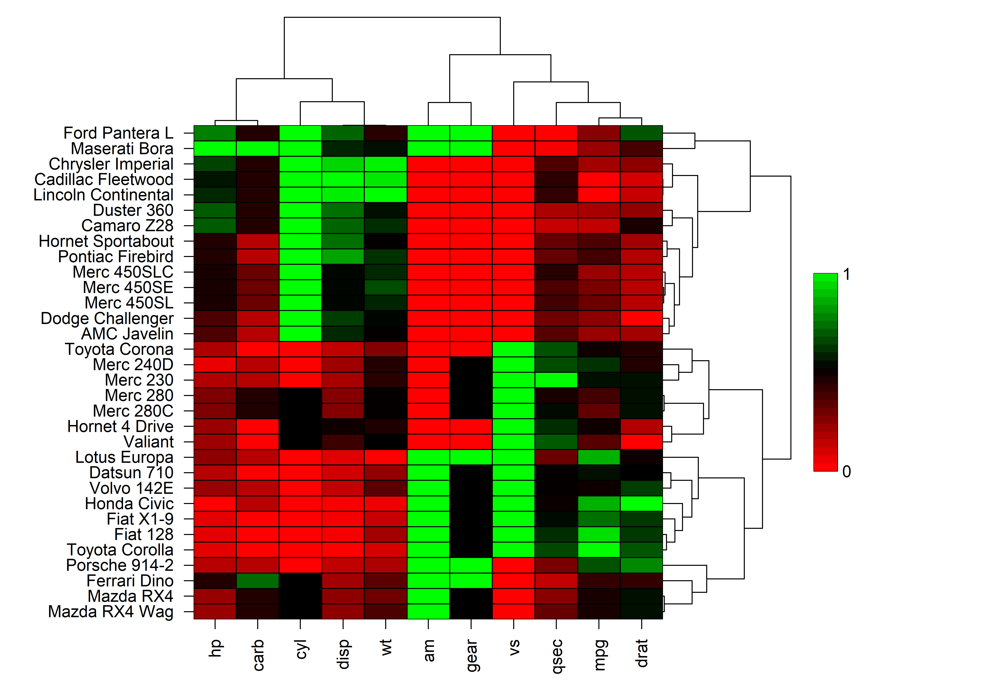
```

## 4.4 Scaled Branch Heights

```{r, eval = FALSE}
heat_map(mtcars, 
         scale = "range",
         dendrogram = "both",
         dendrogram_scale = TRUE)
```

```{r, eval = FALSE, echo = FALSE}
heat_map_save("vignettes/heatmapr/heatmapr-11.png",
              height = 7,
              width = 10,
              res = 500)
heat_map(mtcars, 
         scale = "range",
         dendrogram = "both",
         dendrogram_scale = TRUE)
```

```{r echo = FALSE, out.width = '95%', fig.align="center"}

```

## 7. Display Values

To display the values in the heatmap, simply set `box_text = TRUE` and customize the text using the `box_text_font`, `box_text_size` and `box_text_col` arguments.

```{r, eval = FALSE}
heat_map(mtcars, 
         scale = "range",
         dendrogram = "both",
         dendrogram_scale = TRUE,
         box_text = TRUE)
```

```{r, eval = FALSE, echo = FALSE}
heat_map_save("vignettes/heatmapr/heatmapr-12.png",
              height = 7,
              width = 10,
              res = 500)
heat_map(mtcars, 
         scale = "range",
         dendrogram = "both",
         dendrogram_scale = TRUE, 
         box_text = TRUE)
```

```{r echo = FALSE, out.width = '95%', fig.align="center"}
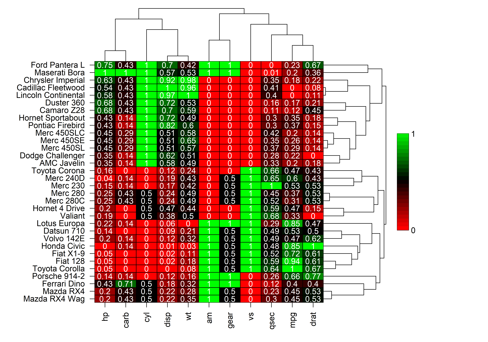
```

## 7. Categorical Variables

`heat_map()` also has full support for datasets that contain non-numeric columns. These columns will be moved to the right of the heatmap and excluded from any scaling, heirarchical clustering or dendrograms. At release, `heat_map()` does not have support for adding legends for these columns, but it is possible to just add text for these non-numeric varaibles by setting `box_text = "character"`. The colours for non-numeric variables can be altered through the `box_col_palette` argument.

```{r, eval = FALSE}
heat_map(iris[sample(150, 30), ], 
         scale = "range",
         dendrogram = "both",
         dendrogram_scale = TRUE,
         box_text = "character",
         box_col_palette = c("magenta",
                             "blue",
                             "orange"))
```

```{r, eval = FALSE, echo = FALSE}
heat_map_save("vignettes/heatmapr/heatmapr-13.png",
              height = 10,
              width = 7,
              res = 500)
heat_map(iris[sample(150, 30), ], 
         scale = "range",
         dendrogram = "both",
         dendrogram_scale = TRUE,
         box_text = "character",
         box_col_palette = c("magenta",
                             "blue",
                             "orange"))
```

```{r echo = FALSE, out.width = '95%', fig.align="center"}
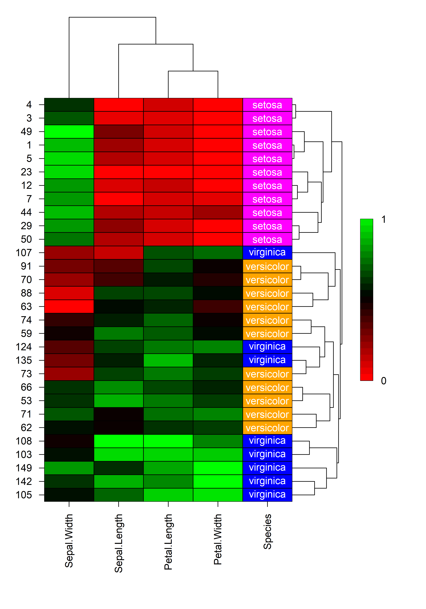
```

## 8. Customization

There are countless ways to customize the appearance of your heatmap using `heat_map()`. Below is an example where a number of features have been customized:

```{r, eval = FALSE}
heat_map(mtcars, 
         scale = "range",
         dendrogram = "both",
         dendrogram_scale = TRUE,
         box_text = TRUE,
         box_text_font = 3,
         box_text_col = "black",
         box_text_col_alpha = 0.5,
         box_border_line_col = "white",
         box_col_scale = c("white",
                           "yellow",
                           "orange",
                           "red"),
         title = "mtcars",
         title_text_font = 2,
         title_text_size = 1.5,
         title_text_col = "red",
         legend_side = 1,
         axis_text_x_side = 3,
         axis_text_y_side = 2,
         axis_label_x = "Parameter",
         axis_label_y = "Model")
```

```{r, eval = FALSE, echo = FALSE}
heat_map_save("vignettes/heatmapr/heatmapr-14.png",
              height = 10,
              width = 10,
              res = 500)
heat_map(mtcars, 
         scale = "range",
         dendrogram = "both",
         dendrogram_scale = TRUE,
         box_text = TRUE,
         box_text_size = 0.8,
         box_text_font = 3,
         box_text_col = "black",
         box_text_col_alpha = 0.5,
         box_border_line_col = "white",
         box_col_scale = c("white",
                           "yellow",
                           "orange",
                           "red"),
         title = "mtcars",
         title_text_font = 2,
         title_text_size = 1.5,
         title_text_col = "red",
         legend_side = 1,
         axis_text_x_side = 3,
         axis_text_y_side = 2,
         axis_label_x = "Parameter",
         axis_label_y = "Model")
```

```{r echo = FALSE, out.width = '95%', fig.align="center"}
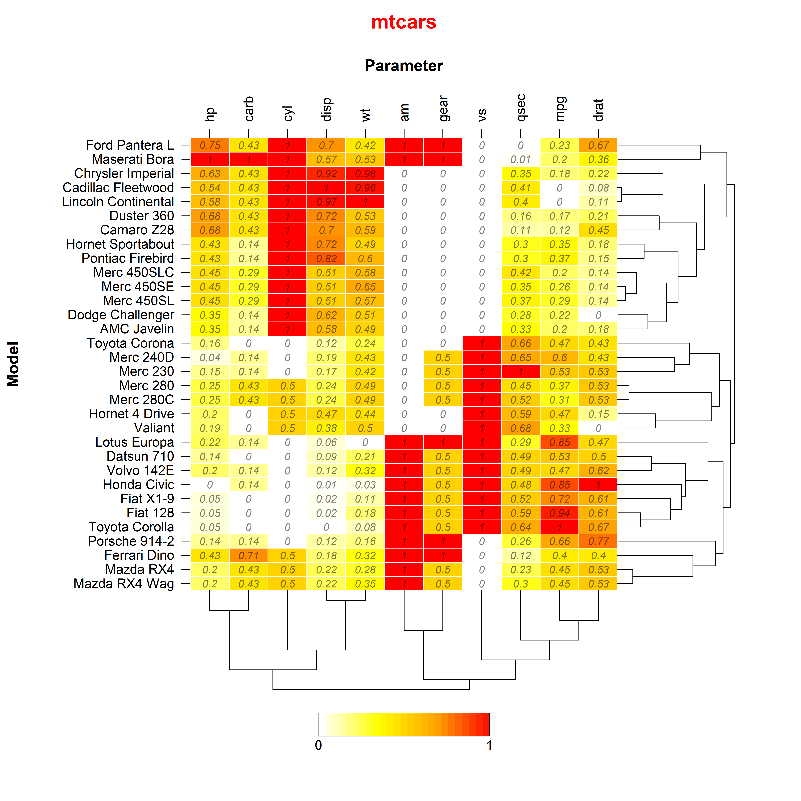
```

## 9. Save High Resolution Images

Saving high resolution heatmaps is as easy as calling `heat_map_save()` prior to calling `heat_map()`. Simply supply a name for the file with a png, jpeg, pdf, tiff or svg file extension and specify the dimensions of the image in inches. For example, the previous plot was exported to a png file using the following code:

```{r, eval = FALSE}
# HEAT_MAP_SAVE
heat_map_save("heat_map.png",
              width = 10,
              height = 10,
              res = 500)
# HEAT_MAP
heat_map(mtcars, 
         scale = "range",
         dendrogram = "both",
         dendrogram_scale = TRUE,
         box_text = TRUE,
         box_text_font = 3,
         box_text_col = "black",
         box_text_col_alpha = 0.5,
         box_border_line_col = "white",
         box_col_scale = c("white",
                           "yellow",
                           "orange",
                           "red"),
         title = "mtcars",
         title_text_font = 2,
         title_text_size = 1.5,
         title_text_col = "red",
         legend_side = 1,
         axis_text_x_side = 3,
         axis_text_y_side = 2,
         axis_label_x = "Parameter",
         axis_label_y = "Model")
```

## 10. Layouts

**heatmapr** has full support for custom plot layouts using `heat_map_layout()`. It is also now possible to arrange your heatmaps with any other plot constructed using base graphics using `layout()` or `par("mfrow")` or `par("mfcol")`. `heat_map_layout()` is simply a conveient wrapper fro these tradional base graphics layout functions. You will need to call `heat_map_save()` prior to `heat_map_layout()` to save high resolution images of custom layouts. You also need to let `heat_map()` know when the layout is ready from saving by running `heat_map_complete()`.

```{r, eval = FALSE, echo = FALSE}
# Save to file
heat_map_save("vignettes/heatmapr/heatmapr-15.png",
              height = 14,
              width = 7,
              res = 500)
# Create layout
heat_map_layout(c(2,1))
# mtcars
heat_map(mtcars,
         scale = "range",
         dendrogram = "both",
         box_col_scale = c("white",
                           "yellow",
                           "orange",
                           "red"))
# iris
heat_map(iris[sample(150, 30),],
         scale = "mean",
         dendrogram = "both",
         box_text = "character",
         box_text_col = "black")
# LAYOUT COMPLETE
heat_map_complete()
```

```{r, eval = FALSE}
# Save to file
heat_map_save("heat_map_layout.png",
              height = 14,
              width = 7,
              res = 500)
# Create layout
heat_map_layout(c(2,1))
# mtcars
heat_map(mtcars,
         scale = "range",
         dendrogram = "both",
         box_col_scale = c("white",
                           "yellow",
                           "orange",
                           "red"))
# iris
heat_map(iris[sample(150, 30),],
         scale = "mean",
         dendrogram = "both",
         box_text = "character",
         box_text_col = "black")
# LAYOUT COMPLETE
heat_map_complete()
```

```{r echo = FALSE, out.width = '95%', fig.align="center"}
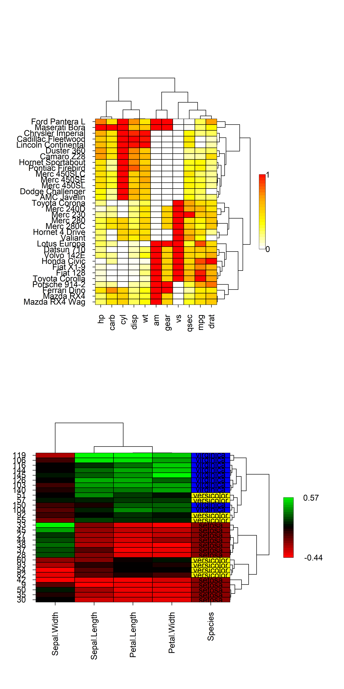
```

## Summary

**heatmapr** is a powerful package for constructing heatmaps that has support for data scaling, hierarchical clustering, dendrograms and categorical variables. Furthermore, **heatmapr** is easy to use, fully customizable, exports high resolution images and has full support for multiplot layouts. 

